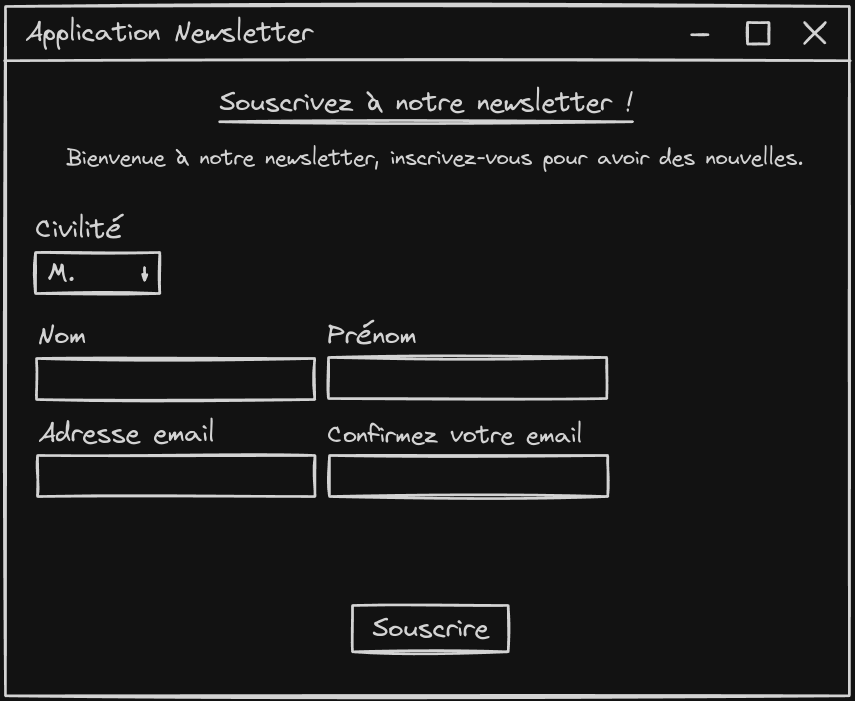

# TP1 - Exercice 2

## Sujet

Analysez l'interface ci-dessous :

Vous allez réaliser cette IHM permettant de s'inscrire à une newsletter.

1. Vous commencerez par lister les composants graphiques qui vous sont nécessaires ;
2. Vous choisirez un ou des gestionnaire(s) de layout permettant de constituer cet affichage ;
3. Vous procéderez à la réalisation de cette IHM : pour cela, créez une classe nommée `FormInscriptionFX.java` ayant comme package `unilim.info.ihm.tp1.exo2` ;
4. Votre `Scene` aura comme largeur 600 pixels et comme hauteur 450 pixels ;
5. Le composant `ComboBox` contiendra les éléments suivants : `M.`, `Mme`, `Mlle.`.

- <https://docs.oracle.com/javafx/2/layout/builtin_layouts.htm>
- <https://docs.oracle.com/javafx/2/layout/size_align.htm>
- <https://docs.oracle.com/javafx/2/ui_controls/combo-box.htm>

## Réponses

### 1. Liste des composants graphiques

- `Label` : "Civilité", "Nom", "Prénom", "Adresse email", "Confirmez votre email", "Souscrivez à notre ...", "Bienvenue à notre ..."
- `ComboBox` : "M.", "Mme", "Mlle."
- `TextField` : pour les champs "Nom", "Prénom", "Adresse email", "Confirmez votre email"
- `Button` : "Souscrire"

### 2. Gestionnaire de layout

- `GridPane` : pour aligner les composants en grille dans le formulaire
- `BorderPane` : pour mettre le formulaire au centre, le bouton en bas et le titre en haut
- `VBox` : pour aligner les composants du haut

### 3., 4. et 5. : Développement

Voir le code source de la classe [`FormInscriptionFX.java`](../../src/unilim/info/ihm/tp1/exo2/FormInscriptionFX.java).
